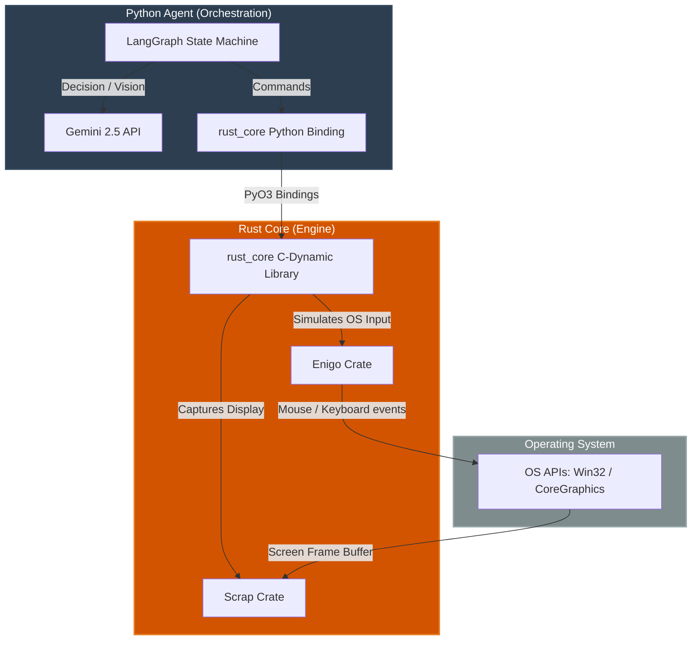

# Cross-Platform Agentic RPA System

A state-of-the-art, cross-platform OS-level Agentic Robotic Process Automation (RPA) system. This workspace integrates a high-performance **Rust Core** for OS-level control (mouse, keyboard, screen capture) with a flexible **Python Agent** driven by **LangGraph** and **Gemini**.

---

## Architecture Overview


---

## Memory Architecture (LangGraph & Supermemory)

The agent utilizes a dual-memory system to ensure high performance and reduce redundant operations over time.

### 1. Short-Term Memory (LangGraph `RPAState`)
During a single execution run, the agent uses LangGraph to maintain a persistent state dictionary (`RPAState`). This state holds the immediate context needed to solve the current objective, such as:
- The latest screen capture.
- Background terminal outputs (`STDOUT`/`STDERR`).
- Current directory contents and active processes.
- The history of actions taken *so far* during this specific task.

Once the objective is successfully completed, this short-term working memory is cleared.

### 2. Long-Term Memory (Supermemory API)
To prevent the agent from re-learning how to solve the same problem from scratch, it integrates with the [Supermemory API](https://supermemory.ai/).
- **Preservation:** When the LangGraph state machine reaches a successful `done` state, it bundles the objective and the exact sequence of successful actions (e.g., terminal commands or python scripts) and saves them to Supermemory's vector database under a specific `containerTag`.
- **Retrieval:** When a new objective is started, the agent first queries Supermemory using hybrid search. If it finds a past successful run for a similar task, it pulls that history back into its short-term `RPAState` as `memory_context`.
- **Execution:** The agent is strictly instructed to leverage this past knowledge. Instead of running trial-and-error searches, it will immediately execute the exact command that worked previously.

#### Example Scenario
1. **First Run ("Find John Deere files"):** The agent tries a recursive search on the `C:\` drive, which times out. It then tries searching `C:\Users`, which succeeds and finds the files. It saves this successful sequence to Supermemory.
2. **Second Run ("Locate John Deere documents"):** The agent queries Supermemory and sees its past success. Instead of searching the `C:\` drive again, it immediately jumps to the optimal `C:\Users` search command, completing the task in seconds instead of minutes.

---

## Key Capabilities

- **Context & State:** The agent dynamically tracks persistent OS state, including current directory contents and the most active background processes (`psutil`), maintaining full context across multi-turn instructions.
- **Dynamic Tool Use:** The orchestration engine intelligently routes actions between basic OS interactions (mouse/keyboard), native terminal commands, and dynamic `python_tool` execution for complex data and file processing.
- **Low-Latency Loop:** Minimized debouncing logic and optimized action loops keep instruction execution latencies well under 1.5 seconds for local command generation.

---

## Directory Structure

```text
├── .devcontainer/
│   └── devcontainer.json   # Setup for unified Python 3.12 & Rust dev environment
├── .gitattributes          # Ensures LF-only line endings across Windows and macOS
├── rust_core/
│   ├── Cargo.toml          # Cargo package definition (pyo3, enigo, scrap dependencies)
│   └── src/
│       └── lib.rs          # PyO3 bindings for OS-level mouse and capture operations
├── python_agent/
│   ├── pyproject.toml      # UV / PEP 621 compliant configuration for agent
│   └── agent.py            # LangGraph RPA workflow linking AI and Rust core
└── README.md               # Getting started & compilation instructions (this file)
```

---

## Getting Started

Follow these instructions to set up, compile, and run the project on your machine (compatible with Windows and macOS).

### 1. Prerequisites

Make sure you have the following installed on your host system or use the provided **Devcontainer** environment:
* [Rust & Cargo](https://rustup.rs/) (edition 2021)
* [Python 3.12](https://www.python.org/downloads/)
* **For Windows**: C++ Build Tools (installed automatically with Visual Studio or Rustup installer).
* **For macOS**: Xcode Command Line Tools (`xcode-select --install`).

---

### 2. Compilation and Setup (Using `maturin`)

`maturin` is used to compile the Rust project into a Python extension module. Follow these exact steps:

#### Step A: Set up a Python Virtual Environment
Navigate to the `python_agent` directory and create/activate a virtual environment:

##### Option 1: Using `uv` (Recommended)
```bash
# Install uv if you don't have it
pip install uv

# Navigate to python_agent
cd python_agent

# Create virtual environment and install dependencies
uv venv
source .venv/bin/activate      # On macOS/Linux
.venv\Scripts\activate         # On Windows (PowerShell)

# Sync/install requirements
uv pip install -e .
```

##### Option 2: Using standard `venv`
```bash
# Navigate to python_agent
cd python_agent

# Create virtual environment
python -m venv .venv

# Activate virtual environment
source .venv/bin/activate      # On macOS/Linux
.venv\Scripts\activate         # On Windows (PowerShell)

# Install Python requirements
pip install -e .
```

#### Step B: Install `maturin` inside the Virtual Environment
Ensure `maturin` is installed in your active Python environment:
```bash
pip install maturin
```

#### Step C: Compile Rust into Python
While inside your active virtual environment, navigate to the `rust_core` directory to build the library:

```bash
# Navigate to rust_core
cd ../rust_core

# Compile and inject the Rust module directly into your Python site-packages
maturin develop
```

> [!NOTE]
> `maturin develop` compiles the Rust module in debug mode (faster compilation) and makes it immediately importable in your active virtual environment as `import rust_core`.
>
> To compile a release build optimized for performance, run:
> ```bash
> maturin develop --release
> ```

---

### 3. Running the Agent

With the Rust extension successfully compiled into the virtual environment, you can now run the Python LangGraph RPA Agent.

```bash
# Navigate back to python_agent
cd ../python_agent

# Run the agent
python agent.py
```

---

### 4. Production Packaging

To compile a production-ready package (a `.whl` Wheel file) to distribute to other developers or servers:

```bash
cd rust_core
maturin build --release
```
The compiled wheel file will be saved in the `rust_core/target/wheels/` directory, ready to be installed via `pip install <wheel_name>.whl`.

---

## OS-Specific Permissions

Since this project simulates inputs and captures the screen, you may need to grant permissions:
* **macOS**: When running `python agent.py` for the first time, you must grant **Accessibility** and **Screen Recording** permissions to the terminal or code editor executing the command (under *System Settings -> Privacy & Security*).
* **Windows**: Depending on permissions of target applications, you may need to run your terminal as Administrator for `enigo` to interact with elevated UI windows.
# RPA
